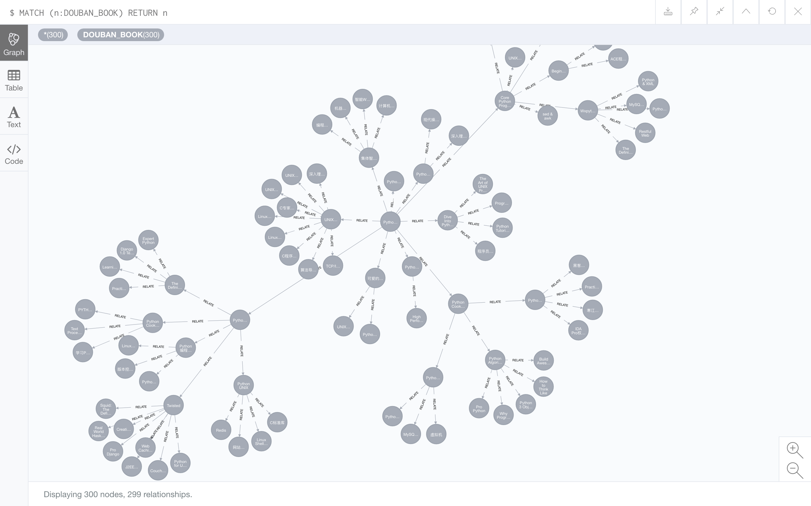

发现图书
=======

从豆瓣某一指定图书页开始抓取豆瓣推荐书目，图书与图书之间建立 RELATE 关系；之后可以使用 Neo4j Browser(http://localhost:7474) 浏览图书。

欢迎 star，欢迎提交 pull requests :hatching_chick:

安装
----

* 首先安装 [neo4j](https://neo4j.com/)

* 再安装 Python 依赖：

		$ pip install requirements.txt

* 最后修改 `crawler/config.py` 中的 `NEO4J_AUTH`：

		NEO4J_AUTH = ('你的 neo4j 用户名，默认一般为 neo4j', '你的 neo4j 密码')

运行
----

**以 'https://book.douban.com/subject/3112503/'(-u) 作为起点开始抓取，最多抓取 100(-C) 本书，开启 8(-t) 个线程：**

	$ python start_crawler.py -u 'https://book.douban.com/subject/3112503/' -C 100 -t 8

**打印帮助信息：**

	$ python start_crawler.py -h

#### 以 'https://book.douban.com/subject/3112503/' 作为起点抓取的 100 本书：

#### 以 'https://book.douban.com/subject/27025715/' 作为起点抓取的 200 本书：

测试
----

	$ pip install -r requirements-dev.txt
	$ pytest

已测试通过 python2.7, python3.6

一些 cypher 语句
----------------

**删除数据库中所有抓取的图书：**

	match (n:DOUBAN_BOOK) detach delete n

License
--------

MIT
